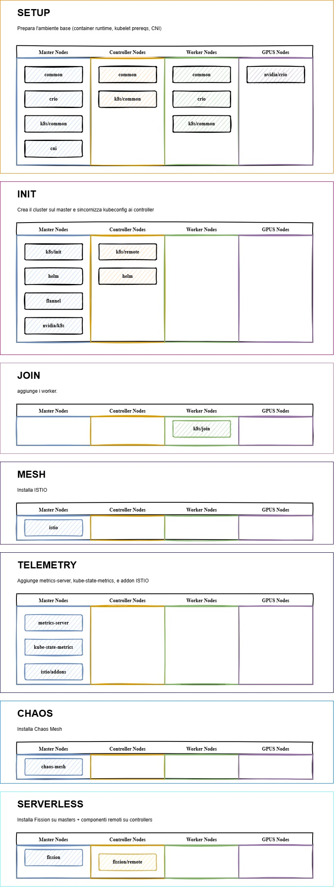

### Link alla repository in esame:

> https://github.com/fglmtt/kubemake

## Cosa avviene in ogni roles:

#### `Chaos-Mesh`

E' una piattaforma Cloud Native per eseguire Chaos Engineering su Kubernets.
Ti consente di iniettare guasti controllati nel cluster (es. network delay, CPU burn, kill di pod, failure DNS, crash di nodi...), monitorare come il sistema reagisce e verificare la resilienza, autorecovery, tolleranza ai guasti.
**Quindi consente di testare sistemi distribuiti in condizioni estreme**

Questo ruolo serve ad installare:

- Chaos Mesh nel cluster Kubernetes
- Abilitarlo nel namespace default
- Configurare l'accesso remoto alla dashboard tramite Istio Gateway
- Creare un profilo RBAC che permette l'uso di Chaos Mesh all'interno del namespace default.

In pratica:

> Il ruolo prepara tutto ciò che serve per lanciare esperimenti di chaos engineering direttamente dal cluster, integrandoli con la parte di rete gestita tramite Istio.

**_Cosa fa la task?_**
Chaos Mesh viene installato nel namespace dedicato `chaos-mesh`, così è isolato dal resto.

Punti chiave installazione:

- `chaosDaemon.runtime = crio`
  Configura Chaos Mesh per funzionare su nodi con runtime **CRI-O**.  
  Senza questa configurazione non potrebbe iniettare fault nei container.
- `enableFilterNamespace: true`
  Permette di **limitare gli esperimenti a specifici namespace**, per sicurezza.
- `version: "{{ chaos_mesh_version }}"`
  Installa esattamente la versione indicata nelle variabili del progetto.

In template è presente un file manifest per aprire la dashboard da remoto, quest'ultimo definisce:

- Un gateway Istio
- Un VirtualService
- Una DestinationRule
  Questa dashboard viene esposta alla rete esterna tramite Istio ingressgateway in modo sicuro e standardizzato con il resto del cluster.

Crea un account manager che può:

- vedere pod e namespace
- lanciare esperimenti
- patchare risorse Chaos Mesh
- creare fault
- eliminare fault
  > Serve per usare Chaos Mesh tramite la dashboard nel namespace di default

#### `cni`

Si occupa dell'installazione dei CNI Plugins (Container Network Interface Plugins) necessari affinchè:

- Il runtime dei container (CRIO)
- Kubernets (Kubelet)
- la rete dei pod
  possano funzionare correttamente.

> Senza CNI plugins, **Kubernetes non sa come assegnare IP ai pod, come collegarli alla rete o come instradare il traffico**. Di fatto **il cluster non funziona**.

I plugin CNI implementano funzionalità come:

- creazione di interfacce virtuali
- assegnazione indirizzi IP ai pod
- routing interno
- gestione DNS nei pod
- politiche di rete
- NAT, bridge, ecc.
  Definisce come i container devono essere collegati alla rete.

Questi plugin vengono installati **in `/opt/cni/bin`**, che è _la directory standard_ dove CRI-O e kubelet si aspettano di trovarli.

**_Cosa fa la tasks?_**

Scarica da GitHub i plugin CNI ufficiali, per:

- versione corretta (`{{ cni_version }}`)
- architettura corretta (`{{ cni_arch }}` → amd64, arm64, ecc.)
  Perché Kubernetes _non_ installa i CNI da solo.  
  Se non li installi manualmente, **i pod rimangono in stato `ContainerCreating` o `CrashLoopBackOff`**.

Mi assicuro che la dir /opt/cni/bin esista altrimenti il networking dei pod non parte.

Estrae tutti i plugin CNI nella directory /opt/cni/bin:

```
/opt/cni/bin/bridge
/opt/cni/bin/host-local
/opt/cni/bin/loopback
/opt/cni/bin/dhcp
...
```

Elimina l'archivio scaricato e rilancia il CRIO e kubelet così che possano leggere le cni!

#### `common`

Il ruolo **common** si occupa di:

1. Preparare il sistema operativo per usare repository personalizzati
2. Installare pacchetti necessari per:
   - aggiungere repository esterni (Kubernetes, CRI-O, ecc.)
   - scaricare chiavi GPG
   - verificare pacchetti
3. Configurare il kernel Linux con le impostazioni richieste da Kubernetes

È un ruolo **di base** che deve essere applicato su tutti i nodi del cluster (master e worker) perché:

> Senza questi prerequisiti, l’installazione di CRI-O, kubeadm, kubelet e kubectl fallirebbe.

**_Cosa fa questa task?_**
Download dei seguenti pacchetti:

- apt-utils -> necessarie per la gestione avanzata
- apt-transport-https -> permette ad apt di usare repository HTTPS
- ca-certificates -> Serve per verificare i certificati SSL dei repository HTTPS.
- gpg -> Serve a impostare chiavi GPG dei repositori e verificare l'autenticità
- curl -> scaricare gpg keys, scaricare script di bootstrap, consultare api esterne....
- software-properties-common -> Fornisce un comando per aggiungere repository esterne come quelle di CRI-O oppure kubernetes

Configura il kernel: /etc/sysctl.d/k8s.conf

```ini
net.ipv4.ip_forward = 1
```

Perchè i nodi devono essere capaci di:

- Far passare pacchetti IP tra interfacce diverse
- Inoltrare traffico dalla rete dei pod verso la rete host
- Supportare overlay network
- Usare CNI come bridge, host-local ed iptables NAT

Infine applicazione immediata della configurazione senza un riavvio del nodo, questo garantiche che rimanga persistente nel file sysctl.

Dopo l'esecuzione di questo task:

- il kernel Linux inoltra correttamente i pacchetti
- la rete kubernetes è pronta per funzionare
- CNI e CRI-O non falliscono

#### `crio`

CRI-O è un runtime container leggero, stabile e minimalista progettato solo per kubernetes. Non è un container generico come Docker o Podman:

> Esiste solo per eseguire i container dei pod Kubernetes.

Kubernetes non gestisce direttamente i container usa il CRI (Container Runtime Interface).

CRI-O è quindi un runtime alternativo a containerd, conosciuto per:

- stabilità e prevedibilità
- Minimo overhead (rispetto a Docker)
- Nessun servizio aggiuntivo inutile
- Migliore sicurezza (usa solo ciò che serve a Kubernetes)

Funzionalità:

- **Eseguire container e pod**: riceve le richieste dal kubelet e lancia i container tramite runc.
- **Gestire le immagini OCI:** CRI-O supporta immagini Docker/OCI (Open Container Initiative)
- **Implementa il CRI (l'API di Kubernetes)**: senza CRI-O, il kubelet non potrebbe lanciare i container.
- **Usare CNI**: i plugin installati nel ruolo cni.

**_Cosa fa questo task?_**

Copia il file di configurazione `modules-load.conf` -> `/etc/modules-load.d/crio.conf`
Questo file indica quali moduli del kernel vanno caricati automaticamente all'avvio.

```
br_nefilter
```

Servono a kubernetes e CRI-O per:

- Vedere il traffico di rete nei bridge virtuali
- Applicare regole iptables sui pacchetti dei pod

Carica immediatamente il modulo br_netfilter.
Questo per permettereal cluster di instradare correttamente il traffico tra i nodi e consentire il NAT e il routing via iptables.

Copia la configurazione `iptables.conf` -> `/etc/sysctl.d/99-kubernetes-cri.conf`
Le impostazioni sono:

```
net.bridge.bridge-nf-call-iptables = 1
net.bridge.bridge-nf-call-ip6tables = 1
net.ipv4.ip_forward = 1
```

Queste sono:

- fonodamentali per Calico/Flannel/Cilium
- Abilitano iptables sulla rete dei pod
- Abilitano il forwarding IP richiesto da kube-proxy

Il comando `systcl --system`: applica immediatamante tutte le configurazioni kernel.

Successivamente scarica la chiave GPG del repo, la converte in un keyring infine aggiunge la sorgente apt in `/etc/apt/source.list.d/cri-o.list`.
Questa paprte configura il sistema per poter installare CRI-O in modo sicuro.

Disintstallazioe di conmon per evitare conflitti (conmon è il processo di monitor che si occupa di staccare il container dal processo CRI-O, collegare gli stream stdou/stderr, monitorare il container)

Infine installa ed abilita CRI-O

#### `fission`

**Fission** è un _framework Serverless per Kubernetes_, cioè:  
ti permette di **scrivere funzioni** (in Python, Node, Go, Bash, ecc.) e Fission le esegue **senza dover creare un container a mano**.

È un’alternativa a:

- AWS Lambda
- Google Cloud Functions
- OpenFaaS
  ma **completamente on-premise** perché gira _interamente_ dentro Kubernetes.

In pratica Fission fa 3 cose:

1. **Gestisce automaticamente i container delle funzioni**
2. **Si integra con l’Autoscaling (KEDA) per scalare a 0**
3. **Permette di creare trigger HTTP, cron, message-queue, Kafka, RabbitMQ ecc**

**_Cosa fa questo task?_**
Crea un namespace fission.

Crea un CRDs (Custom Resource Definitions) di Fission:

- Function
- Environment
- Package
- Trigger
- HTTPTrigger
  Senza queste CRD, kubernetes non saprebbe interpretare le "funzioni" Fission.

Creo un namespace per il monitoring: `fission-monitoring`
Fissa integra metriche per Prometheus, vengono create dashboard dedicate in Grafana.

Successivamente installa:

- Prometheus
- Alertmanager
- Grafana
- Node-exporter
- CRD PrometheusOperator
  Serve per monitorare Fission e KEDA

Viene aggiunta repo helm di fission

Infine installo fission, il quale installa:

- core controller
- executor
- builder
- router
- storage service
- logger
- timers + messaging triggers
- canary deployment engine

Installa il `Fission CLI`.

Installazione del namespace `KEDA`: è un atoscaler serverless basato su eventi. Fission lo usa per scalare a 0 le funzioni.

`KEDA` aggiunge:

- scaler basati su RabbitMQ
- scaler HTTP
- scaler Cron
- scaler Kafka
- scaler Redis
  E' necessario per:
- event-driven scaling
- automatic scale-to-zero
- autoscaling su code RabbitMQ

Namespace e installazione `RabbitMQ` il quale serve come:

- Message Queue per Fission
- Triggers basati su eventi
- Autoscaling KEDA basato su code
  Installazione tramite operator Bitnami.

Viene creato un cluster RabbitMQ gestito dall'operator.
Configurazione:

- `replicas: 1`
- `persistence: false` (no volume)
- `NodePort` per l'accesso
- Plugin MQTT e Management abilitati

#### `Flannel`

**Flannel** è un _CNI (Container Network Interface) plugin_ sviluppato da CoreOS.  
Serve a creare la **rete interna del cluster Kubernetes**.

> Kubernetes da solo **NON ha una rete**

Richiede che un CNI esterno fornisca:

- l’indirizzamento dei pod (es: 10.244.0.0/16)
- il routing tra nodi diversi
- la mascheratura NAT
- la gestione degli overlay network

Flannel è uno dei CNI più semplici e stabili, perfetto per:

- cluster kubeadm
- cluster piccoli/medi
- installazioni on-premise
- ambienti bare-metal

> **Senza Flannel, il cluster NON funziona** → i pod non possono comunicare tra nodi.

**_Cosa fa questa task?_**

Creare il namespace `flannel` dove vivranno il DaemonSet flannel, eventuali configmap e serviceaccount. Separare il CNI in un namespace dedicato è una buona pratica.

Applicare etichette di sicurezza richieste: flannel esegue azioni di rete delicate, per questo richiede un livello di sicurezza privileged.

Aggiungere la Flannel Helm chart repository

Installare Flannel tramite Helm

Configurarlo in modo personalizzato:

- `--ip-masq`: Abilita l’IP mascheramento (NAT) attraverso l’interfaccia del nodo.
  Serve se:
  - i nodi stanno dietro NAT privati
  - vuoi comunicare coi pod da reti esterne
- `--kube-subnet-mgr`:
  - legge la subnet da `node.spec.podCIDR`
  - assegna subnet /24 ai nodi
  - non richiede un suo "etcd" dedicato
    E il modo corretto per usare Flannel in cluster kubeadm, che gestisce il podCIDR.

* `--iface-regex={{ flannel_iface_regex }}`: Flannel deve sapere **quale interfaccia di rete fisica usare**

**_Cosa succeede quando Flannel viene installato?_**

1. **Helm installa un DaemonSet flannel**
2. Su ogni nodo parte un pod che:
   - crea un’interfaccia `flannel.1`
   - crea un’interfaccia veth per ogni pod
   - aggiunge route `/16` per collegare tutti i nodi
   - aggiorna `/run/flannel/subnet.env`
3. Aggiorna iptables per il NAT
4. Stabilisce il mapping:

```
nodo1 → 10.244.1.0/24
nodo2 → 10.244.2.0/24
nodo3 → 10.244.3.0/24
```

5. Kubernetes usa queste route per inviare traffico tra pod

#### `Helm`

Helm è il package manager ufficiale di kubernetes.
Se conosci apt per Ubuntu o npm per javascript, helm fa la stessa cosa ma per kubernetes.

Un chart è un pacchetto che contiene:

```
mychart/
  Chart.yaml        → metadati
  values.yaml       → configurazioni modificabili
  templates/        → i file YAML generati dinamicamente
```

Quest'ultimo è esattamento come un "paccheto software" per kubernetes

**_Cosa fa questa task?_**

1. Installa applicazione kuberentes già pronte
2. Gestisce versioni e aggiornamenti:
   ```
   	helm upgrade nome chart
   	helm rollback nome
   ```
   E come avere versioni della tua app nel cluster.
3. Un Helm chart contiene:
   - Deployment
   - Service
   - ConfigMap
   - Secrets
   - RBAC
   - ...
     Helm usa dei template tamle che si riempiono con le variabili nei values.yaml
   ```yaml
   	replicas: 3
   	image: nginx:latest
   	serviceType: LoadBalancer
   ```

#### `istio`

**Istio** è un **service mesh** per Kubernetes.  
In pratica:

- Gestisce **il traffico tra microservizi**
- Fornisce **sicurezza, osservabilità e resilienza**
- Aggiunge **telemetria e policy** senza modificare il codice delle app

**Componenti principali di Istio**

1. **Pilot** → distribuisce regole di routing ai sidecar Envoy
2. **Envoy sidecar** → container inserito accanto a ogni pod per intercettare il traffico
3. **Mixer** → (vecchio) gestisce telemetria e policy
4. **Citadel / Istiod** → gestisce certificati e sicurezza mTLS
5. **Ingress/Egress Gateway** → punti di ingresso/uscita dal cluster
6. **Addon** → strumenti opzionali come Grafana, Prometheus, Jaeger, Kiali

> Oggi Istio semplifica Mixer e Citadel dentro **Istiod**.

**_Cosa fa la task?_**
Download e installazione di istio.

Configura un Istio Ingressgateway NodePort:

- Configura l'ingress gateway per esporre istio all'esterno tramite NodePort
- Serve a poter raggiungere i servizi Istio dal tuo browser o altri client

Genera il manifest completo di Istio yaml per debug o applicazione manuale.
Utile anche per versioning e gestione di GitOps.

Abilitazione Sidecar Injection:

- Aggiunge la label `istio-injection=enabled` al namespace `default`
- Tutti i pod futuri nel namespace avranno un sidecar envoy automaticamente
- Garantisce che tutto il traffico dei pod passi attraverso istio

| Addon          | Funzione                                   |
| -------------- | ------------------------------------------ |
| **Grafana**    | Dashboard metriche cluster e Istio         |
| **Jaeger**     | Tracing distribuito dei servizi            |
| **Prometheus** | Raccolta metriche Istio e app              |
| **Kiali**      | Visualizzazione topologia servizi e health |

#### `kube-state-metrics`

**Kube-state-metrics** è un componente del **monitoraggio Kubernetes**.  
Non raccoglie metriche sulle risorse del nodo (CPU, RAM, disco), ma **espone metriche sullo stato dei **componenti di Kubernetes\*\*: pod, deployment, replica set, nodes, namespaces, services, ecc.

- È **solo un generatore di metriche**, non un sistema di monitoraggio completo.
- Viene generalmente usato insieme a **Prometheus**, che raccoglie le metriche e permette alerting, grafici e dashboard.

| Componente             | Cosa misura                                                     | Scopo principale                      |
| ---------------------- | --------------------------------------------------------------- | ------------------------------------- |
| **metric-server**      | CPU / memoria dei pod/nodi                                      | Autoscaling HPA                       |
| **kube-state-metrics** | Stato risorse Kubernetes (deployment, replicas, pods, services) | Osservabilità e monitoraggio avanzato |

**_Cosa fa questo task?_**

1. Aggiunge la repository Helm di Prometheus Community → da qui prende i chart ufficiali
2. Installa kube-state-metrics tramite Helm in `kube-system`
3. Crea Deployment, Service e RBAC necessari
4. Espone le metriche sul cluster, pronte per Prometheus

#### `metrics-server`

**Metrics-server** è un componente Kubernetes che raccoglie **metriche delle risorse in tempo reale** dai nodi e dai pod:

- CPU utilizzata
- Memoria utilizzata
  Queste metriche vengono esposte tramite **API Kubernetes** e sono principalmente utilizzate per:
- **HPA (Horizontal Pod Autoscaler)** → autoscaling automatico dei pod
- Monitoraggio leggero delle risorse

Come funziona metrics-server

1. Metrics-server gira come **Deployment** nel namespace `kube-system`
2. Raccoglie metriche dai **kubelets** dei nodi usando l’API `/stats/summary`
3. Espone le metriche tramite **API aggregata Kubernetes** (es: `kubectl top nodes` o `kubectl top pods`)
4. I controller come HPA leggono queste metriche per scalare i pod automaticamente

**_Cosa fa questo task?_**

1. Aggiunge la repository ufficiale Helm di metrics-server
2. Installa metrics-server in `kube-system`
3. Passa alcuni valori:
   - `metrics.enabled: true` → abilita il servizio
   - `--kubelet-insecure-tls` → permette di connettersi ai kubelet anche se il certificato non è trusted (utile in cluster di test o bootstrap)

#### `k8s`

Il ruolo K8s ha tre responsabilità principali:

1. Preparare il sistema per kubernetes: (repository, pacchetti, kubeadm/kubectl/kubelet, swap off, ecc.)
2. Inizializzare il control plan (solo sui master)
3. Far unire i nodi worker (e altri master) al cluster tramite `kubeadm join`

directory:

- `k8s/common/tasks` -> prepara tutte le macchine (master e worker)
- `k8s/init/tasks` -> inizializza solo i master (control-plane)
- `k8s/join/tasks` -> fa eseguire il kubeadm join ai nodi non master

**_Cosa fa `common/tasks`?_**

Questi task preparano l'OS a ospitare kubernete.
Disabilita lo swap: kubernetes richiede che lo swap sia disabilitato per prevedibilità delle performance: `swapoff -a`.

Scarica la chiave gpg ufficiale di kubernetes e la installa correttamente nella keyring

Installa kubelet, kubeadm e kubectl -> il cuore del cluster:

- kubelet -> demone che gestisce il nodo
- kubeadm -> inizializza cluster o permette join
- kubectl -> client CLI

**_Cosa fa `init/tasks?`_**

Questa parte viene eseguita **solo sui master**
Installa i pacchetti di python richiesti dalla collection `community.kubernetes` che ti consentono di usare moduli ansible come `kubernetes.core.k8s`.

Ferma `kubelet` se è già in esecuzione ed esegue `kubeadm init`, questo comando:

- crea il control plane
- crea i certificati
- genera /etc/kubernetes/\*
- genera il token di join
- genera il file admin.conf

Copia `admin.conf` nel `~/.kube/config`: questo permette di usare `kubectl` nel master.

Imposta `--node-ip` per kubelet: serve quando il nodo ha più interfacce o IP multipli.

Riavvia `kubelet`: per applicare le configurazioni.

**_Cosa fa `join/tasks`?_**
Questa parte gira su **worker o ulteriori master**, NON sul controller principale.

Recupera il comando di join dal primo master; controlla se il nodo è già nel cluster (evita errori o doppi join).
Esegue il comando di join e attende che il nodo sia:

- Registrato
- Ready
  Usa il modulo `k8s_info` con wait.

Se il nodo appartiene al gruppo `gpus` applica una label `nvidia.com/gpu.present: true`

Imposta anche qui il comando `--node-ip` nel kubelet (come in init)

Sincronizza il kubeconfig del master sul nodo tramite rsync (`synchronize:`); serve se vuoi usare kubectl anche dai worker/controller.

Copia la private key SSH, imposta permessi e sistema kubeconfig (questo per permettere il pull con `synchronize`).

**_Cosa fa `remote/tasks`?_**
Copia la chiave privata SSH usata da Ansible sul nodo target, rinominandola in `~/.ssh/cluster.pem`.
Questo perchè il task successivo (`synchronize`) deve effettuare un **pull via rsync** dal master.  
`rsync` non usa le connessioni interne di Ansible: quindi ha bisogno **di una chiave SSH reale** per autenticarsi al master.

Crea la cartella `~/.kube` perchè kubernetes si aspetta il kubeconfig in `~/.kube/config`. E' indispensabile per eseguire kubectl dal nodo remoto.

Esegue rsync pull:

- Sorgente -> il kubeconfig del primo master (in `~/.kube/config` del master)
- Destinazione -> il nodo su cui stiamo eseguendo il ruolo
  Questa operazione non viene eseguita sul nodo corrente ma sul primo controller definito nell'inventory.

Perchè farlo da un controller?

- molte topologie di kubernetes hanno controller separati dai worker
- il `kubeconfig` completo serve solo ai controller
- il nodo corrente potrebbe non avere accesso diretto al master
  Quindi:
- `delegate_to` decide chi esegue `rsync`.
- `mode: pull` decide la direzione (dal master verso il controller).

Perchè usare `synchronize` invece di `copy`?

- perchè deve copiare da un nodo remoto a un altro nodo remoto.
- Synchronize usa rsync -> più veloce, atomico ed efficiente

Infine imposta permessi sicuri sul `kubeconfig`:

- solo il proprietario può leggere/scrivere
- nessuna permission per altri utenti
  Perchè è essenziale? `kubeconfig` contiene:
- URL dell'API server
- certificati client
- chiavi di accesso al cluster
  E' un file sensibile come una chiave SSH -> deve essere protetto.

| Directory  | Cosa fa                                                                                         | Dove gira             |
| ---------- | ----------------------------------------------------------------------------------------------- | --------------------- |
| **common** | Installa Kubernetes, aggiunge repo, disabilita swap, installa kubeadm/kubelet/kubectl           | master + worker       |
| **init**   | Inizializza il **control-plane**, installa admin.conf, imposta kubelet                          | solo master           |
| **join**   | Unisce i nodi al cluster, imposta kubelet, sincronizza kubeconfig                               | worker + altri master |
| **remote** | Distribuisce in automatico il kubeconfig del master ai nodi che devono amministrare il cluster. |                       |

#### `nvidia`

Il ruolo nvidia ha due macro-funzioni:

1. Preparare CRI-O per usare GPU nvidia
   Installando e configurando:
   - `nvidia-container-toolkit`
   - runtime NVIDIA per CRI-O
   - configurazioni necessarie perchè CRI-O possa avviare che usano GPU.
2. Installare in kubernetes il Device Plugin NVIDIA
   Questo componente:
   - esporta le GPU
   - consente ai pod di usare la GPU
   - gestisce allocazione, health check, lifecycle.

**_Cosa da `crio/tasks`?_**

Scarica GPG dal repository NVIDIA e rimuove eventuali vecchie chiavi.
Convere le chiavi in formato keyring.

Aggiunge il repository NVIDIA dei container, il quale contiene:

- `nvidia-container-toolkit`
- `nvidia-ctk`
- componenti per runtime NVIDIA

Installa `nvidia-container-toolkit`:
È la componente fondamentale usata dai container engine (Docker, CRI-O, Containerd) per:

- caricare i driver NVIDIA nel container
- montare librerie CUDA
- gestire l’accesso alle GPU
  Senza questo, CRI-O non saprebbe come far accedere i container alla GPU.

Infine configura CRI-O per usare NVIDIA come OCI runtime predefinito.
Questa è la parte _critica_:

- Configura CRI-O per usare `nvidia-container-runtime`
- Aggiunge il file `99-nvidia.conf` in `/etc/crio/crio.conf.d/`
- Senza questo i pod GPU **non possono partire**
  Di fatto dice a CRI-O:
  > “Quando un container richiede GPU, usa il runtime NVIDIA”.

Aggiunge "crun" alla lista dei runtimes
Questo serve perchè:

- Alcune GPU ancora richiedono cgroup v1
- CRI-O usa crun come runtime consigliato
- NVIDIA deve sapere che può usare crun

Installa common (process monitor): CRIO lo usa per:

- monitorare ogni container
- collegare stdio, logging
- gestire lifecycle
  Serve una versione compatibile con NVIDIA.

Crea symlink del binario common: molti tool cercano `common` in `/usr/bin`. E' un fix necessario su alcune distro.

Riavvia CRIO che ricarica un nuovo runtime NVIDIA, configurazioni CRI-O, modifiche a config.toml.

| Funzione          | Descrizione                           |
| ----------------- | ------------------------------------- |
| install toolkit   | Permette ai container di usare la GPU |
| configura runtime | Imposta runtime NVIDIA per CRI-O      |
| supporto crun     | compatibilità cgroups                 |
| conmon fix        | compatibilità CRI-O                   |
| restart crio      | applica le impostazioni               |

**_Cosa fa `k8s/task`?_**
Aggiunge il repository Helm di NVIDIA.
E' il repository contenente il chart ufficiale del device plugin.

Installa il device plugin NVIDIA (in realtà installa un DaemonSet che gira su tutti i nodi GPU e rileva le GPU, registra le risorse presso l'API server, gestisce allocazione GPU ai pod, esegue health monitoring ed abilita richieste tipo).
Perchè kubernetes non sa nativamente cosa sia una GPU.
Il plugin comunica con il kubelet e:

- registra il numero di GPU disponibili.
- permette ai pod di chiederle
- assicura che solo un pod abbia accesso esclusivo a una GPU
- gestisce errori e fallback
  Senza il plugin, anche se CRI-O supporta la GPU. Kubernetes non la vedrebbe comunque.

| Componente    | Descrizione                                    |
| ------------- | ---------------------------------------------- |
| Helm repo     | repository NVIDIA                              |
| device plugin | registra GPU nel cluster, gestisce allocazioni |

#### `rollback`

Il **ruolo `rollback`** in un cluster Kubernetes gestito con Ansible serve per **tornare indietro a uno stato precedente** quando un'operazione di deploy/upgrade fallisce.

---

# L'esecuzione di questi `roles`

Questi ruoli contenenti delle task vengono eseguiti su determinati nodi, maggiori informazioni si trovano sul file `site.yaml`.

Ad ogni modo ecco una spiegazione sintetica di cosa si occupa ogni tag:

- **Setup** prepara l’ambiente base (container runtime, kubelet prereqs, CNI).
- **Init** crea il cluster sul master e sincronizza kubeconfig ai controller.
- **Join** aggiunge i worker.
- **Mesh** installa Istio.
- **Telemetry** aggiunge metrics-server, kube-state-metrics, e addon Istio.
- **Chaos** installa Chaos Mesh.
- **Serverless** installa Fission su masters + componenti remoti sui controllers.



---
